# Lab 4 Report

* [Link](https://github.com/StrawberryAkai/lab3) to my markdown-parse repository.
* [Link](https://github.com/ryankosta/good-markdown-parser) to the reviewed repository.

## Snippet 1 Introducation

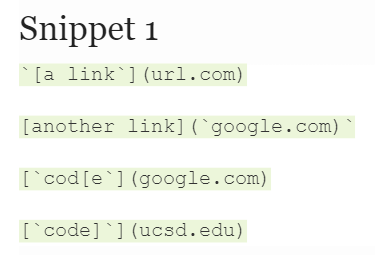

* As you can see from the picture above, this is the first snippet that I
am going to test on my markdown-parse and the other person's md-parse.

* The expected result for this snippet from vscode is 
**[`google.com, google.com, ucsd.edu]**.
The first link doesn't count as link is because you can't have anything before
the open bracket as a link. Let's look at how my implementation did then the
one that I reviewed now.

## My implementation for Snippet 1

* Here is the picture of my Junit test for this snippet.
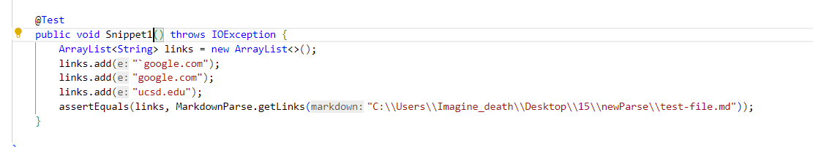

* Unfortunately, my implementation did not output the correct link due
to the fact I did not check anything before the open bracke, so it included
`url.com` in the arraylist as result.
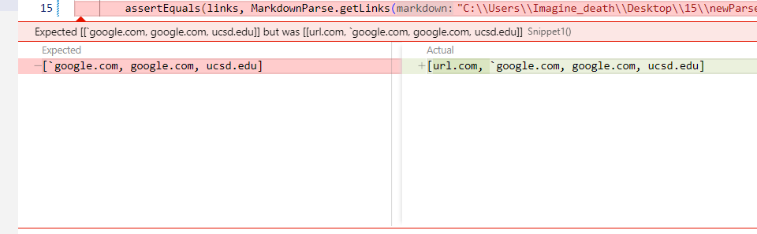

## The Implementation That I Reviewed for Snippet 1

* Here is the picture of the review implementation Junit test for this snippet
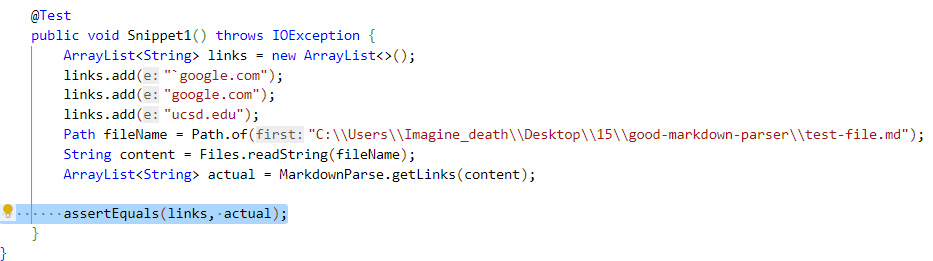

* Unfortunately, the implementation that I reviewed didn't pass the snippet
as well.

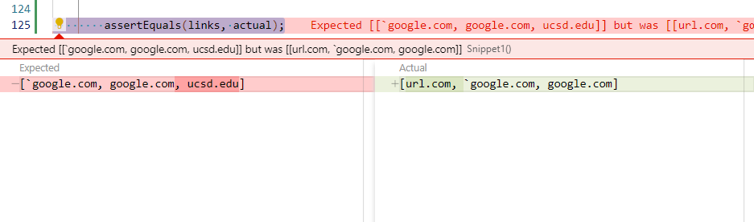

## Snippet 2 Introducation

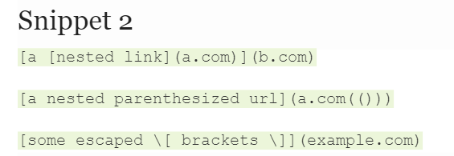

* As you can see from the picture above, this is the second snippet that I
am going to test on my markdown-parse and the other person's md-parse.

* The expected result for this snippet from vscode is 
**[a.com, a.com(()), example.com]**.
The reason why there is no `b.com` is because it is a nested link, it only takes
the link inside instead of the outter one.

## My implementation for Snippet 2

* Here is the picture of my Junit test for this snippet.
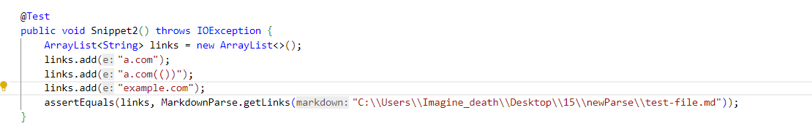

* Unfortunately, my implementation did not output the correct link due
to the fact I have no method that check for nested link and `()` inside of the link.
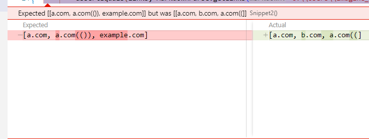

## The Implementation That I Reviewed for Snippet 2

* Here is the picture of the review implementation Junit test for this snippet
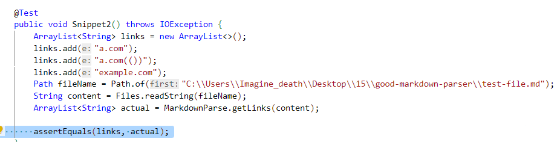

* Unfortunately, the implementation that I reviewed didn't pass the snippet
as well.

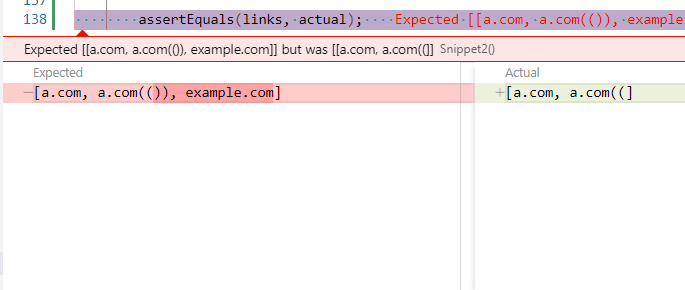

## Snippet 3 Introducation

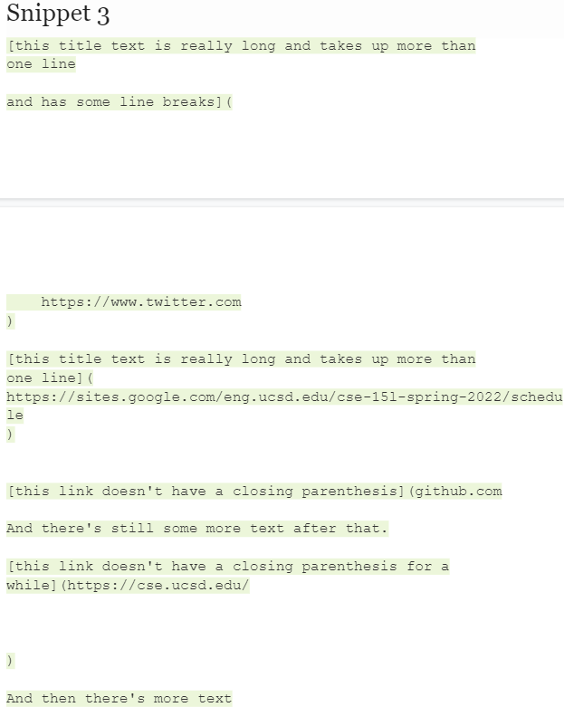

* As you can see from the picture above, this is the last snippet that I
am going to test on my markdown-parse and the other person's md-parse.

* The expected result for this snippet from vscode is 
**[https://sites.google.com/eng.ucsd.edu/cse-15l-spring-2022/schedule]**. It
is because the format of `twitter.com` is wrong, you can't have `[]` in different
line, `github.com` just missing a close parenthesis, and also the same as
`cse.ucsd.edu`.

## My implementation for Snippet 3

* Here is the picture of my Junit test for this snippet.
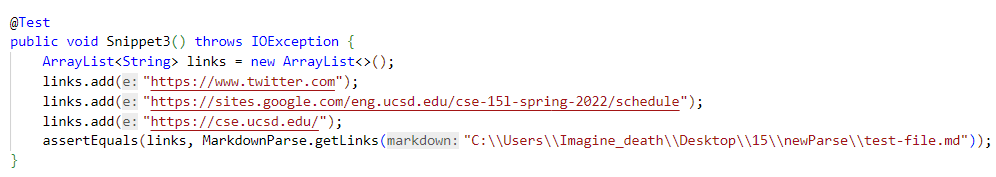

* Unfortunately, my implementation did not output the correct link due
to the fact I haven't though of this kind of edges exmaple that far, so there
is no checking for spliting.

## The Implementation That I Reviewed for Snippet 3

* Here is the picture of the review implementation Junit test for this snippet
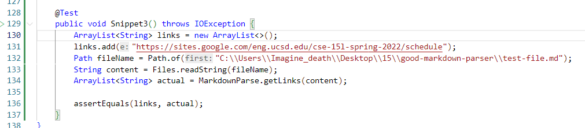

* Unfortunately, the implementation that I reviewed didn't pass the snippet
as well.

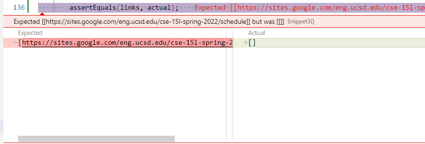

## Answering Questions 1

* I think I can make my implementation to work for snippet 1 within 10 lines.
I just need to check if index of `[` - 1 does not have equal symbols like the
backticks or even `!`. 

## Answering Questions 2

* I don't think I can make my implementation to work for snippet 2 within 10 lines.
I think I need to first check if there is another `[]` inside of `[]`, if 
is true then I need check if is a proper format for a link, if not then I need
to check the outter one for proper format.

## Answering Question 3

* I also don't think that I can make my implementation to work for snippet 3
within 10 line, because it is very difficult to check if brackets and parentheses
are on the same line or not, I mean it will be easy if using regex
matcher to fine the match of it but it is kind of difficult to find the logic
for regex.
